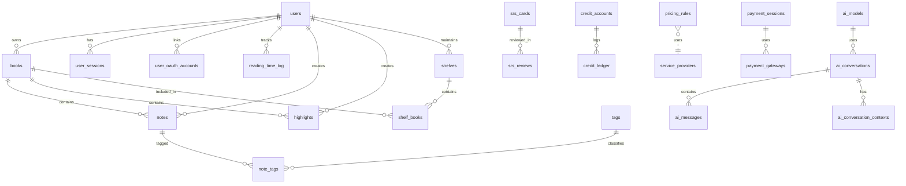

# 04 - 数据库全景与迁移 (Database Schema & Migration Log)

> **版本**：v1.1 (App-First Sync Revision)
> **来源**：基于 Alembic 迁移脚本反推的当前数据库状态。
> **定位**：数据库设计文档与数据字典。任何 Schema 变更必须先更新 Alembic 脚本，再同步此文档。

## 1. 数据库设计原则

*   **主键**：核心表全部使用 UUID (v4)。
*   **软删除**：核心表（如 `notes`, `tags`, `highlights`, `books`）包含 `deleted_at`（Timestamptz, Nullable）。
*   **审计**：所有表包含 `created_at`，大部分表包含 `updated_at`。
*   **安全**：敏感用户数据表（`notes`, `tags`, `highlights`）启用 RLS (Row Level Security)。
*   **同步协议**：支持 App-First 的表必须包含 `updated_at` (TIMESTAMPTZ/TEXT) 和 `is_deleted` (INTEGER 0/1) 字段以支持增量同步。
*   **扩展性**：广泛使用 `JSONB` 存储动态配置与元数据（如 `books.meta`, `system_settings.value`）。
*   **索引优化**：唯一索引 (Unique Index) 必须结合软删除字段，使用 **部分索引 (Partial Index)**，即 `WHERE deleted_at IS NULL`，防止已删除数据的唯一键冲突。
*   **向量存储**：使用 PostgreSQL 原生 **pgvector** 插件，存储于 `vectors` 表，利用 HNSW 索引实现毫秒级召回。**不再维护独立的 OpenSearch 集群**，以降低架构复杂度并确保 ACID 一致性。

## 2. 结构总览 (以 Alembic 为准)

### 2.1 数据库表分组概览 (Table Groups)

以下是当前生产环境中的数据库表结构分组：

> **📝 命名变更记录**：
> - `reading_progress` → `book_position`（阅读位置）
> - `reading_sessions` → `reading_time_log`（阅读时长）
> - `is_digitalized` → `has_text_layer`（在 books 表中）

*   **用户与基础**：`users`, `user_sessions`, `user_stats`, `invites`, `user_reading_goals`, `user_streaks`, `feature_flags`, `system_settings`, `translations`
*   **书籍与内容**：`books`, `shelves`, `shelf_books`, `conversion_jobs`, `tags`
*   **阅读与笔记**：`book_position`, `reading_time_log`, `reading_daily`, `notes`, `highlights`, `note_tags`, `highlight_tags`
*   **AI 与 SRS**：`ai_models`, `ai_conversations`, `ai_messages`, `ai_query_cache`, `ai_conversation_contexts`, `srs_cards`, `srs_reviews`
*   **计费与额度**：`credit_accounts`, `credit_ledger`, `credit_products`, `payment_sessions`, `payment_webhook_events`, `payment_gateways`, `pricing_rules`, `regional_prices`, `service_providers`, `free_quota_usage`
*   **其他服务**：`ocr_jobs`, `doc_events`, `doc_snapshots`, `doc_conflicts`, `doc_drafts`, `prompt_templates`
*   **向量存储**：`vectors` (pgvector 存储表)

## 3. 客户端数据库 (Client-Side Database: SQLite & PowerSync)

> **架构**: 雅典娜采用 App-First 架构，客户端使用 SQLite (Capacitor/WASM) 作为本地数据库。
> **同步引擎**: PowerSync (流式实时复制)。

### 3.1 PowerSync 同步表列表（共 9 个）

> **权威来源**：`web/src/lib/powersync/schema.ts` + `docker/powersync/sync_rules.yaml`


| # | SQLite 表名 | PostgreSQL 源表 | 同步策略 | 说明 |
|---|:-----------|:---------------|:---------|:-----|
| 1 | `books` | `books` | ↕ 双向同步 | 书籍元数据，允许修改 title/author/is_deleted |
| 2 | `book_position` | `book_position` | ↕ 双向同步 | 阅读位置（CFI/页码/进度），LWW 冲突策略 |
| 3 | `reading_time_log` | `reading_time_log` | ↕ 双向同步 | 阅读时长记录，每会话一条 |
| 4 | `notes` | `notes` | ↕ 双向同步 | 用户笔记，Conflict Copy 策略 |
| 5 | `highlights` | `highlights` | ↕ 双向同步 | 高亮标注，Conflict Copy 策略 |
| 6 | `bookmarks` | `bookmarks` | ↕ 双向同步 | 书签 |
| 7 | `shelves` | `shelves` | ↕ 双向同步 | 书架定义 |
| 8 | `shelf_books` | `shelf_books` | ↕ 双向同步 | 书架-书籍关联 |
| 9 | `user_settings` | `user_settings` | ↕ 双向同步 | 用户偏好设置 |

> **📝 命名变更记录**：
> - `reading_progress` → `book_position`（位置记录，非进度统计）
> - `reading_sessions` → `reading_time_log`（时长记录，非会话管理）
>
> **注意**：阅读统计数据通过前端聚合 `reading_time_log` + `book_position` 计算，不作为独立同步表。
> PostgreSQL 有 `reading_daily` 表用于服务端统计，但不同步到客户端。

**本地专用表（不同步）**：
| SQLite 表名 | 说明 |
|:-----------|:-----|
| `local_book_files` | 书籍文件缓存元数据（OPFS/Filesystem 路径） |
| `local_ocr_data` | OCR 双层 PDF 本地缓存 |
| `local_cover_cache` | 封面图片本地缓存 |
| `local_tts_settings` | TTS 设置（音色、速度、音量）|
| `local_tts_models` | TTS 模型缓存（DLC 下载状态）|
| `global_search_index` | 全文搜索索引表 (FTS5) |
| `global_search_fts` | FTS5 虚拟表 |

**Sidecar 只读数据库**：
| 数据库文件 | 大小 | 说明 |
|:----------|:-----|:-----|
| `dict_master.db` | ~40MB | 权威词典（CC-CEDICT + WordNet + ECDICT）|

### 3.2 book_position 表字段映射对照表 🔑

> **📝 命名变更**：原 `reading_progress` → `book_position`（更准确反映"阅读位置"语义）
>
> **权威来源**：`docker/powersync/sync_rules.yaml` + `web/src/lib/powersync/schema.ts`

| SQLite (前端) | PostgreSQL (后端) | 类型 | 前端使用说明 |
|:-------------|:-----------------|:-----|:------------|
| `user_id` | `user_id` | UUID | 复合主键 |
| `book_id` | `book_id` | UUID | 复合主键 |
| `progress` | `progress` | REAL (0-1) | 阅读进度百分比，前端代码中映射为 `percentage` |
| `last_cfi` | `last_cfi` | TEXT | EPUB CFI 位置字符串 |
| `last_page` | `last_page` | INTEGER | 当前页码（PDF 用） |
| `total_pages` | `total_pages` | INTEGER | 总页数（PDF 用） |
| `finished_at` | `finished_at` | TEXT (ISO8601) | 读完时间 |
| `updated_at` | `updated_at` | TEXT (ISO8601) | 最后更新时间 |

> ⚠️ **重要**：前端代码在业务层使用语义化字段名（如 `percentage`, `currentCfi`），
> 但在 SQL 查询中必须使用 PowerSync Schema 定义的字段名。

### 3.3 reading_time_log 表字段映射对照表

> **📝 命名变更**：原 `reading_sessions` → `reading_time_log`（更准确反映"时长记录"语义）
> - 原 `total_ms` → `duration_ms`（更直观的字段名）
>
> **权威来源**：`docker/powersync/sync_rules.yaml` + `web/src/lib/powersync/schema.ts`

| SQLite (前端) | PostgreSQL (后端) | 类型 | 说明 |
|:-------------|:-----------------|:-----|:-----|
| `id` | `id` | UUID | 主键 |
| `user_id` | `user_id` | UUID | 用户 ID |
| `book_id` | `book_id` | UUID | 书籍 ID |
| `device_id` | `device_id` | TEXT | 设备 ID |
| `is_active` | `is_active` | INTEGER (0/1) | 会话是否活跃 |
| `duration_ms` | `duration_ms` | INTEGER | 阅读时长（毫秒） |
| `created_at` | `created_at` | TEXT (ISO8601) | 会话开始时间 |
| `updated_at` | `updated_at` | TEXT (ISO8601) | 最后心跳时间 |

> ⚠️ **注意**：`duration_ms` 是毫秒单位，显示分钟需要 `/60000`。

### 3.4 books 表字段映射对照表 🔑

> **⚠️ 关键说明**：PostgreSQL 使用 `has_text_layer` 存储（语义：是否有文字层/可搜索），  
> 通过 sync_rules.yaml 映射为 SQLite 的 `is_image_based`（语义：是否图片型/需OCR）。  
> **两者语义相反！** 映射公式：`is_image_based = NOT has_text_layer OR text_layer_confidence < 0.8`
>
> **📝 命名变更记录**：
> - `is_digitalized` → `has_text_layer`（更清晰的语义）
> - `initial_digitalization_confidence` → `text_layer_confidence`（配套更名）

| SQLite (前端) | PostgreSQL (后端) | sync_rules 映射 | 类型 | 说明 |
|:-------------|:-----------------|:----------------|:-----|:-----|
| `id` | `id` | 直接映射 | UUID | 主键 |
| `user_id` | `user_id` | 直接映射 | UUID | 所属用户 |
| `title` | `title` | 直接映射 | TEXT | 书名 |
| `author` | `author` | 直接映射 | TEXT | 作者 |
| `cover_url` | `cover_image_key` | `AS cover_url` | TEXT | 封面 S3 Key |
| `file_type` | `original_format` | `AS file_type` | TEXT | 原始格式 |
| `file_size` | `size` | `AS file_size` | INTEGER | 文件大小 (bytes) |
| `content_sha256` | `content_sha256` | 直接映射 | TEXT | 文件哈希 |
| `storage_key` | `minio_key` | `AS storage_key` | TEXT | MinIO 存储 Key |
| `metadata_confirmed` | `metadata_confirmed` | 直接映射 | INTEGER (0/1) | 元数据已确认 |
| `is_image_based` | `has_text_layer` | **⚠️ 语义转换** | INTEGER (0/1) | 见下方计算公式 |
| `ocr_status` | `ocr_status` | 直接映射 | TEXT | OCR 处理状态 |
| `conversion_status` | `conversion_status` | 直接映射 | TEXT | 格式转换状态 |
| `converted_epub_key` | `converted_epub_key` | 直接映射 | TEXT | 转换后 EPUB Key |
| `page_count` | `meta->>'page_count'` | **提取 JSONB** | INTEGER | 书籍页数 |
| `is_deleted` | `deleted_at` | **软删除转换** | INTEGER (0/1) | 见 09 文档 §0.4 |
| `created_at` | `created_at` | 直接映射 | TEXT (ISO8601) | 创建时间 |
| `updated_at` | `updated_at` | 直接映射 | TEXT (ISO8601) | 更新时间 |

**`is_image_based` 计算公式（sync_rules.yaml）**：
```sql
-- 在 sync_rules.yaml 中计算
(CASE 
  WHEN has_text_layer = false THEN 1        -- 明确的图片型
  WHEN has_text_layer = true AND text_layer_confidence < 0.8 THEN 1  -- 低置信度
  ELSE 0                                      -- 文字型
END) as is_image_based
```

**`is_deleted` 计算公式（sync_rules.yaml）**：
```sql
-- PostgreSQL deleted_at → SQLite is_deleted
(CASE WHEN deleted_at IS NOT NULL THEN 1 ELSE 0 END) as is_deleted
```

**PostgreSQL 独有字段（不同步到 SQLite）**：
| 字段 | 用途 | 不同步原因 |
|:-----|:-----|:----------|
| `canonical_book_id` | SHA256 去重引用 | 后端内部逻辑 |
| `storage_ref_count` | 存储引用计数 | 后端内部逻辑 |
| `source_etag` | 上传幂等性 | 后端内部逻辑 |
| `digitalize_report_key` | 数字化报告 Key | 后端内部逻辑 |
| `ocr_pdf_key` | OCR 双层 PDF Key | 后端内部逻辑 |
| `deleted_at` | 软删除时间戳 | 转换为 `is_deleted` |
| `ocr_requested_at` | OCR 请求时间 | 后端内部逻辑 |
| `vector_indexed_at` | 向量索引时间 | 后端内部逻辑 |
| `language` | 书籍语言 | 考虑未来同步 |

### 3.3 PowerSync 认证与权限

> **认证说明**：PowerSync Service 在建立连接时通过 JWT 解析出 `user_id`，并在 Sync Rules 中使用参数化查询 `WHERE user_id = bucket.user_id`（而非 PostgreSQL 的 `current_setting()`）。

**写入权限矩阵**：
| 表 | PowerSync 可写 | 限制说明 |
|:---|:--------------|:---------|
| `books` | ⚠️ 部分可写 | 仅能 UPDATE `metadata_confirmed`, `deleted_at`, `title`, `author` |
| `book_position` | ✅ INSERT/UPDATE | LWW 策略，`updated_at` 比较 |
| `reading_time_log` | ✅ INSERT/UPDATE | 会话心跳更新 |
| `notes` | ✅ CRUD | Conflict Copy 策略 |
| `highlights` | ✅ CRUD | Conflict Copy 策略 |
| `bookmarks` | ✅ CRUD | 无冲突处理 |
| `shelves` | ✅ CRUD | 字段级合并 |
| `shelf_books` | ✅ CRUD | 需要 `user_id` 字段 |
| `user_settings` | ✅ UPSERT | JSONB 合并策略 |

> **权威来源**：`docker/powersync/sync_rules.yaml`

---

## 4. 实体关系图 (ERD)



## 5. 数据字典 (Data Dictionary)

### 5.1 用户与认证 (User & Auth)

#### `users`
用户核心表。
*   `id` (UUID, PK)
*   `email` (TEXT, Unique, Lowercase)
*   `display_name` (TEXT)
*   `is_active` (BOOLEAN, Default: TRUE)
*   `membership_tier` (TEXT, Default: 'FREE')
*   `language` (TEXT, Default: 'zh-CN')
*   `timezone` (TEXT, Default: 'Asia/Shanghai')
*   `membership_expire_at` (TIMESTAMPTZ, Nullable)
*   `monthly_gift_reset_at` (TIMESTAMPTZ, Nullable)
*   `free_ocr_usage` (INTEGER, Default: 0)
*   `invite_code` (VARCHAR(10), Unique, Nullable) - 用户专属邀请码 (e.g. "ATHENA888")。
*   `version` (INTEGER, Default: 1)
*   `updated_at` (TIMESTAMPTZ)

#### `user_sessions`
用户登录会话。
*   `id` (UUID, PK)
*   `user_id` (UUID, FK `users.id`)
*   `revoked` (BOOLEAN, Default: FALSE)
*   `created_at` (TIMESTAMPTZ)

#### `user_oauth_accounts` 🆕
用户 OAuth 第三方账号绑定表。
*   `id` (UUID, PK)
*   `user_id` (UUID, FK `users.id`)
*   `provider` (VARCHAR(20)) - OAuth 提供商：`wechat` / `google` / `microsoft` / `apple`
*   `provider_user_id` (TEXT) - 第三方用户 ID
*   `provider_email` (TEXT, Nullable) - 第三方邮箱
*   `access_token` (TEXT, Encrypted) - 加密存储的 Access Token
*   `refresh_token` (TEXT, Nullable, Encrypted) - 加密存储的 Refresh Token
*   `token_expires_at` (TIMESTAMPTZ, Nullable) - Token 过期时间
*   `raw_profile` (JSONB) - 第三方原始用户信息
*   `created_at` (TIMESTAMPTZ)
*   `updated_at` (TIMESTAMPTZ)
*   **索引**：
    *   `UNIQUE (provider, provider_user_id)` - 每个第三方账号只能绑定一个用户
    *   `UNIQUE (user_id, provider)` - 每个用户每个平台只能绑定一个账号

#### `user_stats`
用户统计聚合表。
*   **Source**: Created in Migration `0111` (f1a2b3c4d5e6).
*   `user_id` (UUID, PK)
*   `invite_count` (INTEGER, Default: 0)
*   `extra_storage_quota` (BIGINT, Default: 0)
*   `extra_book_quota` (INTEGER, Default: 0)
*   `storage_used` (BIGINT, Default: 0)
*   `book_count` (INTEGER, Default: 0)
*   `updated_at` (TIMESTAMPTZ)

#### `invites`
邀请使用记录 (裂变日志)。
*   `id` (UUID, PK)
*   `inviter_id` (UUID, FK `users.id`)
*   `invitee_id` (UUID, FK `users.id`, Unique) - 每个新用户只能被邀请一次。
*   `code_used` (VARCHAR(20)) - 记录当时使用的邀请码（快照）。
*   `status` (VARCHAR(20), Default: 'pending')
*   `completed_at` (TIMESTAMPTZ, Nullable)
*   `created_at` (TIMESTAMPTZ)

### 5.2 书籍与资产 (Books & Assets)

#### `books`
核心书籍表。
*   `id` (UUID, PK)
*   `user_id` (UUID)
*   `title` (TEXT)
*   `author` (TEXT, Nullable)
*   `language` (TEXT, Nullable)
*   `original_format` (TEXT, Nullable)
*   `minio_key` (TEXT)
*   `size` (BIGINT, Nullable)
*   `cover_image_key` (TEXT, Nullable)
*   `source_etag` (TEXT, Nullable)
*   `has_text_layer` (BOOLEAN, Nullable) - `true`=文字型, `false`=图片型, `null`=未检测 (**📝 原名 is_digitalized**)
*   `text_layer_confidence` (NUMERIC, Nullable) - 文字层置信度 (**📝 原名 initial_digitalization_confidence**)
*   `converted_epub_key` (TEXT, Nullable)
*   `digitalize_report_key` (TEXT, Nullable)
*   **处理状态字段**:
    *   `processing_status` (VARCHAR(32), Default: 'pending') - 统一处理状态: `pending` -> `processing` -> `converting` / `ocr_pending` -> `ready` / `failed`
    *   `processing_error` (TEXT, Nullable) - 处理失败原因 (e.g. "encrypted_file", "conversion_failed")
    *   `reader_type` (VARCHAR(10), Nullable) - 前端阅读器类型: `pdf` 或 `epub`
    *   `is_readable` (BOOLEAN, Default: FALSE) - 是否可打开阅读 (存在 MinIO 文件)
    *   `is_interactive` (BOOLEAN, Default: FALSE) - 是否可交互 (存在文字层，可划线/AI)
*   `ocr_status` (VARCHAR(20), Nullable) - [Deprecated] 逐步合并入 processing_status
*   `ocr_requested_at` (TIMESTAMPTZ, Nullable) - 用户请求 OCR 的时间
*   `ocr_pdf_key` (TEXT, Nullable) - OCR 产出的**双层 PDF**（Dual-Layer PDF）的 MinIO Key
*   `vector_indexed_at` (TIMESTAMPTZ, Nullable) - 向量索引完成时间
*   `metadata_confirmed` (BOOLEAN, Default: FALSE) - 用户是否已确认元数据
*   `metadata_confirmed_at` (TIMESTAMPTZ, Nullable) - 元数据确认时间
*   `content_sha256` (VARCHAR(64), Nullable) - **文件内容 SHA256 哈希**，用于全局去重
*   `storage_ref_count` (INTEGER, Default: 1) - **存储引用计数**，表示有多少书籍共享此存储
*   `canonical_book_id` (UUID, Nullable, FK `books.id`) - **去重引用指向的原始书籍 ID**
*   `deleted_at` (TIMESTAMPTZ, Nullable) - **软删除时间戳**
*   `meta` (JSONB, Default: '{}')
    *   `page_count` (int): 书籍页数
    *   `needs_manual` (bool): 是否需要人工介入
    *   `toc` (list): 目录结构 (Confirmed by usage)
        *   Schema: `[{ "title": "Chapter 1", "href": "ch1.html", "children": [...] }]`
    *   `cover_color` (string): 封面主色调 (Confirmed by usage)
    *   `is_scanned` (bool): 是否为扫描版 (Confirmed by usage)
    *   `dpi` (int): 扫描分辨率 (Confirmed by usage)
    *   `reflow_profile` (string): 重排参数 (Confirmed by usage)
    *   **Note**: 元数据字段 schema 未来将迁移到 OpenAPI 契约统一维护。
*   `version` (INTEGER, Default: 1)
*   `created_at` (TIMESTAMPTZ)
*   `updated_at` (TIMESTAMPTZ)

**索引**：
- `idx_books_content_sha256` (部分索引): `WHERE content_sha256 IS NOT NULL`
- `idx_books_canonical_book_id`: 用于查询引用书籍

**`processing_status` 状态机枚举值**：
| 值 | 说明 | 前端行为 |
|---|---|---|
| `pending` | 初始状态 | 显示"等待中" |
| `processing` | 提取元数据/检测中 | 显示"处理中" |
| `converting` | 格式转换中 (MOBI→EPUB) | 显示"特定格式转换中..." (不可读) |
| `ocr_pending` | 图片型 PDF 待决策 | 显示"建议 OCR" (可读不可划线) |
| `ocr_processing` | OCR 处理中 | 显示"OCR 转换中..." (可读不可划线) |
| `ready` | 处理完成 | 正常阅读与交互 |
| `failed` | 失败 | 显示错误原因 (如"加密文件") |

> **元数据确认说明**：
> - `metadata_confirmed = false`：用户尚未确认元数据，上传后应弹出确认对话框
> - `metadata_confirmed = true`：用户已确认（或跳过），不再提示
> - `title` 和 `author` 字段会作为 AI 对话上下文发送给上游模型

> **SHA256 去重机制说明**：
> - `content_sha256`: 用于全局去重判断，相同哈希表示相同文件内容
> - `storage_ref_count`: 初始值为 1（代表原书自己），秒传引用时 +1，引用书删除时 -1
> - `canonical_book_id`: 非空时表示这是一个去重引用书，指向原始书籍
> - 原书判断：`canonical_book_id IS NULL`
> - 引用书判断：`canonical_book_id IS NOT NULL`

> **is_image_based 判断逻辑**（前端用于显示 OCR 按钮）：
> ```python
> is_image_based = (
>     (has_text_layer == False)  # 图片型 PDF
>     OR (has_text_layer == True AND text_layer_confidence < 0.8)  # 低置信度
>     OR ocr_status == 'completed'  # 已完成 OCR 的书籍
> )
> ```

#### 书籍删除策略（Soft Delete & Hard Delete）

书籍删除采用**分层策略**，区分私人数据和公共数据：

| 场景 | 删除类型 | 行为 |
|-----|---------|------|
| 原书有引用 (`ref_count > 1`) | 软删除 | 设置 `deleted_at`，保留公共数据 |
| 原书无引用 (`ref_count <= 1`) | 硬删除 | 物理删除所有数据 |
| 引用书删除 | 硬删除 | 删除记录，减少原书 `ref_count`，检查原书是否需清理 |

**公共数据 vs 私人数据**：
| 数据类型 | 所有者 | 软删除时 | 硬删除时 |
|---------|-------|---------|----------|
| MinIO 文件 (PDF/EPUB) | 共享 | 保留 | 删除 |
| 封面图片 | 共享 | 保留 | 删除 |
| OCR 双层 PDF | 共享 | 保留 | 删除 |
| 向量索引 (pgvector) | 共享 | 保留 | 删除 |
| 笔记/高亮 | 用户私有 | 立即删除 | 立即删除 |
| 阅读进度 | 用户私有 | 立即删除 | 立即删除 |
| 书架关联 | 用户私有 | 立即删除 | 立即删除 |

**删除流程伪代码**：
```python
def delete_book(book_id, user_id):
    book = get_book(book_id)
    
    # 1. 始终删除用户私有数据
    delete_notes(book_id, user_id)
    delete_highlights(book_id, user_id)
    delete_book_position(book_id, user_id)
    delete_shelf_books(book_id)
    
    # 2. 判断是引用书还是原书
    if book.canonical_book_id:
        # 引用书：直接删除，减少原书引用计数
        canonical = get_book(book.canonical_book_id)
        canonical.storage_ref_count -= 1
        delete_book_record(book_id)  # 物理删除
        
        # 检查原书是否需要清理
        if canonical.deleted_at and canonical.storage_ref_count <= 1:
            hard_delete_canonical(canonical)
    else:
        # 原书：检查引用计数
        has_references = book.storage_ref_count > 1
        
        if has_references:
            # 软删除：保留公共数据
            book.deleted_at = now()
        else:
            # 硬删除：清理所有公共数据
            delete_minio_file(book.minio_key)
            delete_minio_file(book.cover_image_key)
            delete_minio_file(book.ocr_pdf_key)
            delete_search_index(book_id)
            delete_book_record(book_id)
```

#### `shelves`
书架。
*   `id` (UUID, PK)
*   `user_id` (UUID)
*   `name` (TEXT)
*   `description` (TEXT, Nullable)
*   `version` (INTEGER, Default: 1)
*   `created_at` (TIMESTAMPTZ)
*   `updated_at` (TIMESTAMPTZ)

#### `shelf_books`
书架-书籍关联。
*   `id` (UUID, PK)
*   `shelf_id` (UUID)
*   `book_id` (UUID)
*   `user_id` (UUID) - 冗余存储，用于 PowerSync 同步过滤
*   `sort_order` (INTEGER, Nullable)
*   `added_at` (TIMESTAMPTZ)
*   约束：UNIQUE (shelf_id, book_id)

#### `conversion_jobs`
书籍格式转换任务。
*   `id` (UUID, PK)
*   `user_id` (UUID) - (**Verified**: Defined as `user_id` in Alembic `0100`. If app code uses `owner_id`, it requires refactoring.)
*   `book_id` (UUID)
*   `source_key` (TEXT)
*   `target_format` (TEXT)
*   `output_key` (TEXT, Nullable)
*   `status` (TEXT, Default: 'pending')
*   `error` (TEXT, Nullable)
*   `created_at` (TIMESTAMPTZ)
*   `updated_at` (TIMESTAMPTZ)

### 5.3 笔记与高亮 (Notes & Highlights)

#### `notes`
用户笔记 (启用 RLS)。
*   `id` (UUID, PK)
*   `user_id` (UUID)
*   `book_id` (UUID)
*   `content` (TEXT)
*   `chapter` (TEXT, Nullable)
*   `location` (TEXT, Nullable)
*   `pos_offset` (INTEGER, Nullable)
*   `tsv` (TSVECTOR, Nullable) - 用于 PostgreSQL 内置全文检索（配合 pgvector 向量搜索使用）
*   `version` (INTEGER, Default: 1)
*   `device_id` (VARCHAR(64), Nullable) - 创建该笔记的设备 ID，用于冲突检测
*   `conflict_of` (UUID, Nullable, FK `notes.id`) - 如果是冲突副本，指向原始笔记
*   `deleted_at` (TIMESTAMPTZ, Nullable)
*   `created_at` (TIMESTAMPTZ)
*   `updated_at` (TIMESTAMPTZ)

> **冲突副本说明**：当多设备同时修改同一笔记时，不采用静默覆盖（LWW），而是创建冲突副本。
> - `conflict_of` 指向原始笔记 ID
> - 前端在笔记列表显示冲突标记，用户可手动合并
> - 合并后删除冲突副本

#### `highlights`
高亮 (启用 RLS)。
*   `id` (UUID, PK)
*   `user_id` (UUID)
*   `book_id` (UUID)
*   `start_location` (TEXT)
*   `end_location` (TEXT)
*   `color` (TEXT, Nullable)
*   `comment` (TEXT, Nullable)
*   `tsv` (TSVECTOR, Nullable) - 用于 PostgreSQL 内置全文检索（配合 pgvector 向量搜索使用）
*   `version` (INTEGER, Default: 1)
*   `device_id` (VARCHAR(64), Nullable) - 创建该高亮的设备 ID
*   `conflict_of` (UUID, Nullable, FK `highlights.id`) - 如果是冲突副本，指向原始高亮
*   `deleted_at` (TIMESTAMPTZ, Nullable)
*   `created_at` (TIMESTAMPTZ)
*   `updated_at` (TIMESTAMPTZ)

#### `tags`
标签系统 (启用 RLS)。
*   `id` (UUID, PK)
*   `user_id` (UUID)
*   `name` (TEXT)
*   `version` (INTEGER, Default: 1)
*   `deleted_at` (TIMESTAMPTZ, Nullable)
*   `created_at` (TIMESTAMPTZ)
*   `updated_at` (TIMESTAMPTZ)

#### `note_tags`
笔记-标签关联表 (Many-to-Many)。
*   `note_id` (UUID, PK, FK `notes.id`)
*   `tag_id` (UUID, PK, FK `tags.id`)
*   **Note**: 迁移脚本 `0106` 中尚未包含 `created_at`，建议在后续版本补充。

#### `highlight_tags`
高亮-标签关联表 (Many-to-Many)。
*   `highlight_id` (UUID, PK, FK `highlights.id`)
*   `tag_id` (UUID, PK, FK `tags.id`)
*   **Note**: 迁移脚本 `0106` 中尚未包含 `created_at`，建议在后续版本补充。

### 5.4 阅读进度 (Reading Progress)

> **📝 命名变更记录**：
> - `reading_sessions` → `reading_time_log`（时长记录）
> - `reading_progress` → `book_position`（位置记录）
> - `total_ms` → `duration_ms`（时长字段）

#### `reading_time_log`
阅读时长记录（每次打开阅读器创建一条）。
*   `id` (UUID, PK)
*   `user_id` (UUID, FK)
*   `book_id` (UUID)
*   `device_id` (TEXT, Nullable)
*   `is_active` (BOOLEAN, Default: TRUE)
*   `duration_ms` (BIGINT, Default: 0) - 本次会话累计时长（毫秒）
*   `last_active_at` (TIMESTAMPTZ, Default: now())

#### `reading_daily`
每日阅读统计（仅服务端，不同步）。
*   `user_id` (UUID, PK)
*   `day` (DATE, PK)
*   `total_duration_ms` (BIGINT, Default: 0)

#### `user_streaks`
用户阅读连续天数统计。
*   `user_id` (UUID, PK, FK `users.id`)
*   `current_streak` (INTEGER, Default: 0)
*   `longest_streak` (INTEGER, Default: 0)
*   `last_read_date` (DATE, Nullable)
*   `updated_at` (TIMESTAMPTZ)

#### `book_position`
每本书的阅读位置状态。
*   `user_id` (UUID, PK)
*   `book_id` (UUID, PK)
*   `progress` (NUMERIC, Default: 0) - 阅读进度 (0-1)
*   `last_cfi` (TEXT, Nullable) - EPUB CFI 位置字符串
*   `last_page` (INTEGER, Nullable) - 当前页码（PDF 用）
*   `total_pages` (INTEGER, Nullable) - 总页数（PDF 用）
*   `finished_at` (TIMESTAMPTZ, Nullable) - 读完时间
*   `ocr_version` (VARCHAR(64), Nullable) - OCR 数据版本哈希
*   `metadata_version` (VARCHAR(64), Nullable) - 书籍元数据版本
*   `vector_index_version` (VARCHAR(64), Nullable) - 向量索引版本
*   `last_sync_at` (TIMESTAMPTZ, Nullable) - 最后一次完整同步时间
*   `updated_at` (TIMESTAMPTZ)

#### `user_reading_goals`
用户阅读目标。
*   `user_id` (UUID, PK, FK `users.id`)
*   `daily_minutes` (INTEGER, Default: 30)
*   `yearly_books` (INTEGER, Default: 10)
*   `updated_at` (TIMESTAMPTZ)

### 5.5 商业与计费 (Billing)

#### `credit_accounts`
用户积分账户。
*   `user_id` (UUID, PK)
*   `balance` (BIGINT, Default: 0)
*   `currency` (TEXT, Nullable)
*   `wallet_amount` (NUMERIC, Default: 0)
*   `wallet_currency` (TEXT, Default: 'CNY')
*   `updated_at` (TIMESTAMPTZ)

#### `credit_ledger`
积分流水账。
*   `id` (UUID, PK)
*   `user_id` (UUID)
*   `amount` (BIGINT)
*   `currency` (TEXT)
*   `reason` (TEXT, Nullable)
*   `related_id` (UUID, Nullable)
*   `direction` (TEXT)
*   `created_at` (TIMESTAMPTZ)

#### `credit_products`
积分充值商品。
*   `id` (UUID, PK)
*   `code` (TEXT, Unique)
*   `name` (TEXT)
*   `credits` (INTEGER)
*   `amount_minor` (INTEGER)
*   `currency` (TEXT, Default: 'CNY')
*   `updated_at` (TIMESTAMPTZ)

#### `payment_sessions`
支付会话。
*   `id` (UUID, PK)
*   `user_id` (UUID)
*   `gateway` (TEXT)
*   `amount` (INTEGER)
*   `currency` (TEXT)
*   `status` (TEXT, Default: 'pending')
*   `return_url` (TEXT, Nullable)
*   `cancel_url` (TEXT, Nullable)
*   `external_id` (TEXT, Nullable)
*   `metadata` (JSONB, Nullable)
*   `created_at` (TIMESTAMPTZ)
*   `updated_at` (TIMESTAMPTZ)

#### `payment_webhook_events`
支付回调事件记录。
*   `id` (TEXT, PK)
*   `gateway` (TEXT)
*   `session_id` (UUID, Nullable)
*   `payload` (JSONB, Nullable)
*   `processed` (BOOLEAN, Default: FALSE)
*   `created_at` (TIMESTAMPTZ)
*   `updated_at` (TIMESTAMPTZ)

#### `payment_gateways`
支付网关配置。
*   `id` (UUID, PK)
*   `name` (TEXT, Unique)
*   `config` (JSONB)
*   `is_active` (BOOLEAN, Default: TRUE)
*   `version` (INTEGER, Default: 1)
*   `created_at` (TIMESTAMPTZ)
*   `updated_at` (TIMESTAMPTZ)

#### `pricing_rules`
定价规则。
*   `id` (UUID, PK)
*   `service_type` (VARCHAR(32))
*   `unit_type` (VARCHAR(32))
*   `unit_size` (INTEGER)
*   `price_amount` (NUMERIC(10,2))
*   `currency` (VARCHAR(10))
*   `region` (VARCHAR(10), Nullable)
*   `remark_template` (TEXT, Nullable)
*   `platform` (VARCHAR(20), Default: 'web')
*   `sku_id` (VARCHAR(100), Nullable)
*   `is_active` (BOOLEAN)
*   `version` (INTEGER)
*   `created_at` (TIMESTAMPTZ)
*   `updated_at` (TIMESTAMPTZ)

#### `regional_prices`
区域定价策略。
*   `id` (UUID, PK)
*   `plan_code` (VARCHAR(50))
*   `currency` (VARCHAR(10))
*   `period` (VARCHAR(20))
*   `amount_minor` (INTEGER)
*   `updated_at` (TIMESTAMPTZ)
*   `version` (INTEGER, Default: 1)

#### `service_providers`
第三方服务商配置。
*   `id` (UUID, PK)
*   `service_type` (TEXT)
*   `name` (TEXT)
*   `endpoint` (TEXT, Nullable)
*   `config` (JSONB, Default: '{}')
*   `is_active` (BOOLEAN, Default: TRUE)
*   `priority` (INTEGER, Default: 0)
*   `version` (INTEGER, Default: 1)
*   `updated_at` (TIMESTAMPTZ)

#### `free_quota_usage`
免费额度使用记录。
*   `user_id` (UUID, PK)
*   `service_type` (TEXT, PK)
*   `period_start` (DATE, PK)
*   `used_units` (BIGINT, Default: 0)

### 5.6 AI 与向量 (AI & Vectors)

#### `ai_models`
AI 模型配置。
*   `id` (UUID, PK)
*   `provider` (TEXT)
*   `model_id` (TEXT, Unique)
*   `display_name` (TEXT)
*   `active` (BOOLEAN, Default: TRUE)
*   `updated_at` (TIMESTAMPTZ)

#### `ai_conversations`
AI 对话 Session（启用 RLS）。
*   `id` (UUID, PK)
*   `user_id` (UUID, FK)
*   `title` (TEXT)
*   `book_id` (UUID, Nullable, FK `books.id`) - 关联书籍（可选）
*   `related_context` (JSONB, Nullable) - 上下文（选中文本、笔记引用等）
*   `conversation_history` (JSONB) - 消息历史数组，见 02 文档 §2.5 的 `AIMessage` 结构
*   `version` (INTEGER, Default: 1) - 乐观锁版本号（用于 ETag/If-Match）
*   `deleted_at` (TIMESTAMPTZ, Nullable) - 软删除时间
*   `created_at` (TIMESTAMPTZ)
*   `updated_at` (TIMESTAMPTZ)

**索引**：
*   `idx_ai_conversations_user_created_at` ON `(user_id, created_at DESC)`

**RLS 策略**：参见 02 文档 §2.5

#### `ai_messages`
对话消息记录（可选，用于细粒度存储；也可直接使用 `conversation_history` JSONB）。
*   `id` (UUID, PK)
*   `conversation_id` (UUID, FK `ai_conversations.id`)
*   `user_id` (UUID)
*   `role` (TEXT) - `user` | `assistant` | `system`
*   `content` (TEXT)
*   `refs` (JSONB, Nullable) - 引用信息
*   `created_at` (TIMESTAMPTZ)

#### `ai_conversation_contexts`
对话上下文关联。
*   `conversation_id` (UUID, PK, FK `ai_conversations.id`)
*   `user_id` (UUID)
*   `mode` (TEXT, Nullable)
*   `book_ids` (JSONB, Nullable)
    *   Array of UUID strings: `["uuid1", "uuid2"]`
*   `updated_at` (TIMESTAMPTZ)

#### `ai_query_cache`
AI 响应缓存。
*   `user_id` (UUID, PK)
*   `conversation_id` (UUID, Nullable)
*   `query_hash` (TEXT, PK)
*   `prompt` (TEXT, Nullable)
*   `response` (TEXT, Nullable)
*   `updated_at` (TIMESTAMPTZ)

#### `srs_cards`
间隔复习卡片。
*   `id` (UUID, PK)
*   `user_id` (UUID)
*   `highlight_id` (UUID, Unique)
*   `question` (TEXT)
*   `answer` (TEXT)
*   `created_at` (TIMESTAMPTZ)
*   `updated_at` (TIMESTAMPTZ)

#### `srs_reviews`
复习记录。
*   `id` (UUID, PK)
*   `user_id` (UUID)
*   `card_id` (UUID, FK `srs_cards.id`)
*   `ease_factor` (NUMERIC, Default: 2.5)
*   `repetitions` (INTEGER, Default: 0)
*   `interval_days` (INTEGER, Default: 1)
*   `last_grade` (INTEGER, Nullable)
*   `next_review_at` (TIMESTAMPTZ, Nullable)
*   `updated_at` (TIMESTAMPTZ)

#### `vectors` (Future Plan / Not Implemented)
*   **Status**: [待迁移]
*   **Description**: 计划引入的 pgvector 向量索引表，用于替代 `ai_query_cache` 的部分功能并支持全文向量检索。
*   **Note**: 当前系统可能使用 `ai_query_cache` 或内存向量库，此表尚未实装。
*   **Proposed Schema**: `embedding_id`, `user_id`, `content_type`, `content_id`, `embedding vector(1536)`.

### 5.7 文档协作 (Realtime Docs)

#### `doc_events`
文档编辑事件日志。
*   `id` (UUID, PK)
*   `doc_id` (TEXT)
*   `content` (TEXT)
*   `created_at` (TIMESTAMPTZ)
*   **Note**: 当前实现仅为基础日志。未来版本计划增加 `version` (int), `actor_id` (uuid), `ops` (jsonb), `is_conflict` (bool) 以支持完整 CRDT/OT 协作。

#### `doc_snapshots`
文档快照。
*   `id` (UUID, PK)
*   `doc_id` (TEXT)
*   `snapshot` (TEXT)
*   `created_at` (TIMESTAMPTZ)

#### `doc_conflicts`
编辑冲突记录。
*   `id` (UUID, PK)
*   `doc_id` (TEXT)
*   `base_version` (INTEGER)
*   `actual_version` (INTEGER)
*   `created_at` (TIMESTAMPTZ)

#### `doc_drafts`
文档草稿。
*   `id` (UUID, PK)
*   `doc_id` (TEXT)
*   `snapshot` (TEXT)
*   `created_at` (TIMESTAMPTZ)

### 5.8 其他服务与系统 (Other Services & System)

#### `ocr_jobs`
OCR 识别任务。
*   `id` (UUID, PK)
*   `user_id` (UUID)

*   `book_id` (UUID, Nullable)
*   `source_key` (TEXT)
*   `status` (TEXT, Default: 'uploading')
*   `result_text` (TEXT, Nullable)
*   `error` (TEXT, Nullable)
*   `page_count` (INTEGER, Default: 0)
*   `deduction_strategy` (VARCHAR(50), Nullable)
*   `deduction_amount` (INTEGER, Default: 0)
*   `created_at` (TIMESTAMPTZ)
*   `updated_at` (TIMESTAMPTZ)

#### `prompt_templates`
AI 提示词模板。
*   `id` (UUID, PK)
*   `name` (TEXT, Unique)
*   `content` (TEXT)
*   `updated_at` (TIMESTAMPTZ)
*   **Note**: 迁移脚本 `0103` 中尚未包含 `variables`, `version`, `description`，建议在后续版本补充。

#### `system_settings`
系统全局配置。
*   `id` (UUID, PK)
*   `key` (TEXT, Unique)
*   `value` (JSONB)
*   `updated_at` (TIMESTAMPTZ)

#### `feature_flags`
功能特性开关。
*   `id` (UUID, PK)
*   `key` (TEXT, Unique)
*   `is_enabled` (BOOLEAN, Default: FALSE)
*   `updated_at` (TIMESTAMPTZ)

### 5.9 同步服务 (Sync Service)

#### `sync_events`
服务端待推送事件队列。
*   `id` (UUID, PK)
*   `user_id` (UUID, FK `users.id`)
*   `book_id` (UUID, FK `books.id`)
*   `event_type` (VARCHAR(32))
*   `payload` (JSONB)
*   `created_at` (TIMESTAMPTZ)
*   `delivered_at` (TIMESTAMPTZ, Nullable)

#### `translations`
多语言翻译资源。
*   `id` (UUID, PK)
*   `namespace` (TEXT)
*   `key` (TEXT)
*   `lang` (TEXT)
*   `value` (JSONB)
*   `deleted_at` (TIMESTAMPTZ, Nullable)
*   `version` (INTEGER, Default: 1)
*   `updated_at` (TIMESTAMPTZ)
*   Constraint: `UNIQUE(namespace, key, lang)`

## 6. RLS 策略详解 (Row Level Security)

当前仅以下表启用了 RLS，策略均为 **Owner Isolation**：

1.  **Notes** (`notes`)
2.  **Tags** (`tags`)
3.  **Highlights** (`highlights`)

**策略逻辑**：
```sql
USING (
  user_id = current_setting('app.user_id')::uuid 
  OR current_setting('app.role', true) = 'admin'
)
WITH CHECK (
  user_id = current_setting('app.user_id')::uuid 
  OR current_setting('app.role', true) = 'admin'
)
```
*   **读取/修改**：仅允许 `user_id` 匹配当前 Session 变量 `app.user_id` 的行。
*   **例外**：如果 Session 变量 `app.role` 为 `admin`，则拥有完全访问权限。
*   **依赖**：应用层必须在连接 PgBouncer 后、执行查询前，执行 `SET app.user_id = '...'`。
*   **警告**：必须确保在 PgBouncer (transaction pooling) 环境下，通过 `SET LOCAL app.user_id` 完成用户隔离。禁止匿名访问，否则 query 会被错误共享，造成严重越权问题。

**未来扩展计划**：
*   **书籍共享模式**：计划引入 `book_shares` 表，支持多用户对同一书籍的只读或协作权限。届时 RLS 策略需升级为 `user_id = current_user OR EXISTS (SELECT 1 FROM book_shares WHERE book_id = ...)`。
*   **团队/组织隔离**：引入 `organization_id`，支持 B 端租户隔离。

## 7. 索引优化 (Indexes)

核心业务索引（自动创建）：

*   **唯一性约束**：
    *   `books(user_id, source_etag)` -> `uniq_books_user_etag`
    *   `tags(user_id, name)` (Partial: `WHERE deleted_at IS NULL`) -> `uniq_tags_user_name_active`
    *   `srs_cards(highlight_id)`
    *   `invites(invite_code)` -> `ix_invites_code`
    *   `regional_prices(plan_code, currency, period)` -> `ix_regional_prices_uniq`
*   **性能优化**：
    *   `shelves(user_id, updated_at DESC)` -> `idx_shelves_user_updated`
    *   `books(user_id, updated_at DESC)`
    *   `notes(user_id, updated_at DESC)` -> `idx_notes_user_updated`
    *   `highlights(user_id, updated_at DESC)` -> `idx_highlights_user_updated`
    *   `reading_time_log(user_id, last_active_at DESC)` -> `idx_reading_time_log_user`
    *   `book_position(user_id, updated_at DESC)` -> `idx_book_position_user`
    *   `reading_progress(user_id, finished_at)` -> `idx_reading_progress_user_finished`
    *   `conversion_jobs(user_id, status, created_at DESC)`
    *   `credit_ledger(user_id, created_at DESC)`
*   **全文检索/JSONB**：
    *   `books((meta->>'page_count'))` -> `idx_books_meta_page`
    *   `notes USING GIN(tsv)` -> `idx_notes_tsv`
    *   `highlights USING GIN(tsv)` -> `idx_highlights_tsv`

## 8. 逻辑分层与命名规范 (Logical Domains & Naming Conventions)

### 8.1 领域逻辑划分
为辅助 AI 代码生成与理解，数据库表按以下领域逻辑划分：

*   **User Domain**: `users`, `user_sessions`, `user_stats`, `invites`, `user_reading_goals`, `user_streaks`
*   **Book Domain**: `books`, `shelves`, `shelf_books`, `conversion_jobs`
*   **Notes Domain**: `notes`, `highlights`, `tags`, `note_tags`, `highlight_tags`
*   **Reading Domain**: `reading_progress`, `reading_sessions`, `reading_daily`
*   **Sync Domain**: `sync_events`
*   **Billing Domain**: `credit_accounts`, `credit_ledger`, `credit_products`, `payment_*`, `pricing_rules`
*   **AI Domain**: `ai_*`, `srs_*`, `vectors`
*   **Realtime Docs Domain**: `doc_*`
*   **System Domain**: `system_settings`, `feature_flags`, `translations`, `audit_logs`

### 8.2 表命名规范
*   **Case**: 全部小写 (lowercase)，使用下划线分隔 (snake_case)。
*   **Pluralization**: 表名使用复数 (e.g., `users`, `books`)，关联表使用动词或组合名 (e.g., `user_sessions`, `shelf_books`)。
*   **Primary Key**: 统一命名为 `id`，类型为 `UUID`。
*   **Timestamps**: 所有表必须包含 `created_at`，大部分表包含 `updated_at` (TIMESTAMPTZ)。
*   **Foreign Keys**: 使用 `singular_table_name_id` (e.g., `user_id`, `book_id`)。
*   **Boolean**: 使用 `is_` 或 `has_` 前缀 (e.g., `is_active`, `is_digitalized`)，或状态形容词 (e.g., `processed`, `revoked`)。

> **设计规范**：`conversion_jobs` 表的外键字段必须使用 `user_id`，禁止使用 `owner_id`。

---

## 9. 本地专用表详细定义 (Local-Only SQLite)

> **说明**：以下表仅存在于客户端 SQLite，不参与 PowerSync 同步。

### 9.1 TTS 设置表

```sql
-- 本地 TTS 设置 (单例)
CREATE TABLE local_tts_settings (
    id INTEGER PRIMARY KEY CHECK (id = 1),
    voice_id TEXT DEFAULT 'zh_cn_female_01',
    speed REAL DEFAULT 1.0,
    volume REAL DEFAULT 1.0,
    auto_scroll BOOLEAN DEFAULT TRUE,
    updated_at TEXT DEFAULT (datetime('now'))
);

-- TTS 模型缓存
CREATE TABLE local_tts_models (
    model_id TEXT PRIMARY KEY,
    language TEXT NOT NULL,
    display_name TEXT NOT NULL,
    file_path TEXT NOT NULL,
    file_size INTEGER NOT NULL,
    is_bundled BOOLEAN DEFAULT FALSE,
    downloaded_at TEXT
);
```

### 9.2 全局搜索索引表

```sql
-- 全局搜索联合索引 (FTS5)
CREATE TABLE global_search_index (
    id INTEGER PRIMARY KEY AUTOINCREMENT,
    source_type TEXT NOT NULL,   -- 'book_content' | 'note' | 'highlight' | 'book_meta'
    source_id TEXT NOT NULL,
    book_id TEXT NOT NULL,
    chunk_index INTEGER DEFAULT 0,
    raw_text TEXT NOT NULL,
    segmented_text TEXT NOT NULL,
    location_data TEXT,
    updated_at TEXT DEFAULT (datetime('now')),
    UNIQUE(source_type, source_id, chunk_index)
);

CREATE VIRTUAL TABLE global_search_fts USING fts5(
    segmented_text,
    content='global_search_index',
    content_rowid='id',
    tokenize='unicode61'
);
```

### 9.3 Sidecar 词典数据库 (`dict_master.db`)

> **存储模式**：只读 SQLite 数据库，App 内置打包，约 40MB。

```sql
-- 词条表
CREATE TABLE entries (
    id INTEGER PRIMARY KEY,
    word TEXT NOT NULL,
    language TEXT NOT NULL,    -- 'zh', 'en'
    phonetic TEXT,
    pos TEXT,                  -- 词性
    definitions TEXT NOT NULL, -- JSON 数组
    examples TEXT,             -- JSON 数组
    etymology TEXT,
    frequency INTEGER DEFAULT 0
);

CREATE INDEX idx_entries_word ON entries(word);
CREATE INDEX idx_entries_language ON entries(language, word);

-- FTS 全文搜索
CREATE VIRTUAL TABLE entries_fts USING fts5(
    word, definitions,
    content='entries',
    content_rowid='id'
);
```

**词典来源**：
| 语言 | 词典 | 词条数 | 许可证 |
|-----|------|-------|-------|
| 中文 | CC-CEDICT | ~120,000 | CC BY-SA |
| 英文 | WordNet 3.1 | ~150,000 | WordNet License |
| 英汉 | ECDICT | ~770,000 | MIT |

---

> **文档结束** - 客户端数据库架构请参见 Section 3 (SQLite + PowerSync)。